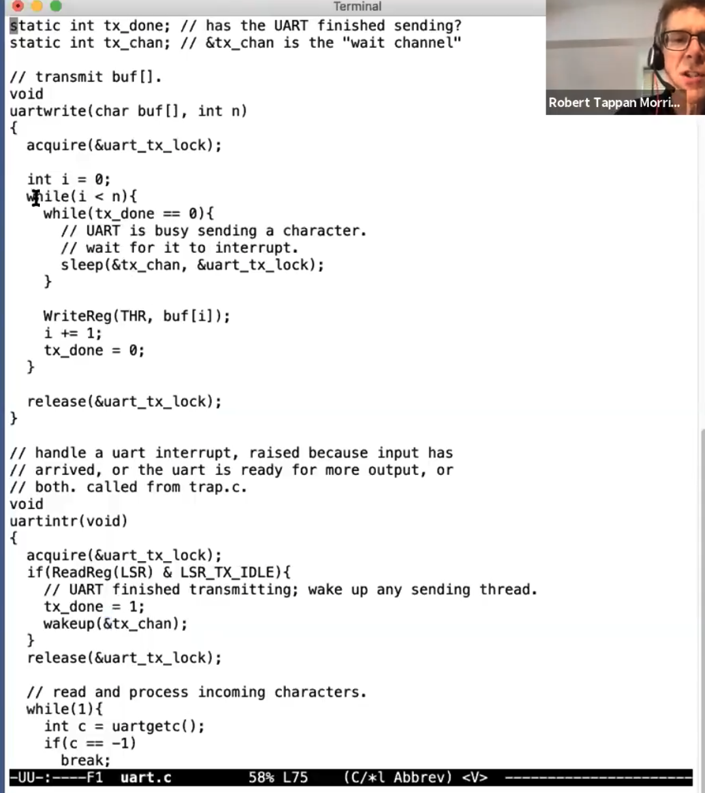
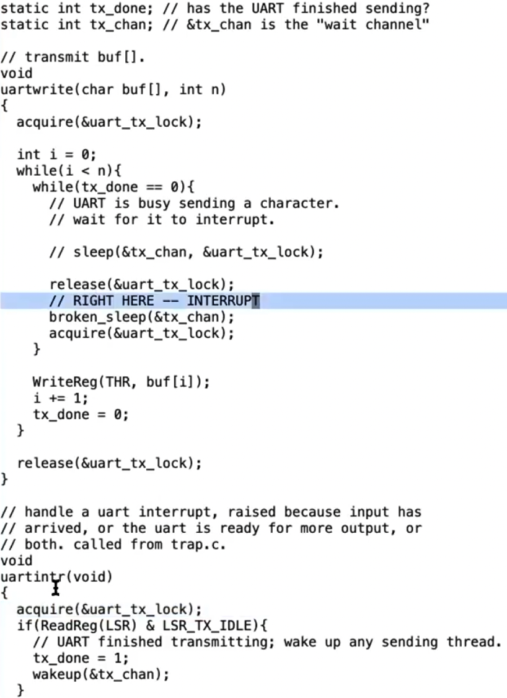

<style>
img{
    width: 80%;
}
</style>

<!--more-->

# 6.S081 lec11, 12: Thread Switching

**THREAD**: one serial execution
* PC, REGS, STACK

**Interleave**
* Multiple-core
* Switch among threads **each core**

**share memory?**
* xv6 kernel threads share kernel memory
* xv6 user processes - each has **only one thread** -> no share memory
* In Linux, multiple threads in a process -> shares memory

---

## Challenges

* Switching - interleave
  * Scheduling
* what to save/restore
* compute-bound threads
  * how to pause them

---

### Dealing w/ compute bound threads

Solution: timer interrupt


P1 interruptted by timer, save its state in **Trapframe**
call *swtch()* to switch the kernel context to **scheduler's context**

The scheduler thread state is saved **per core**, it then switches the context to P2's kernel thread's.

The P2's kernel thread **returns to userspace** and activate userlevel thread of P2. 

---

## How scheduler works in xv6

1. timer interrupts, user process **traps** into kernel mode,

   and finally *yield()* is called

2. In *yield()*, `p->state`is changed, and more importantly `sched()` is called

3. In `sched()`, sanity checks are done. But the core is `swtch()`

4. In `swtch()`, the calling arguments are`swtch(&p->context, &mycpu()->context)`, namely swtching between `process's kernel thread` and `per-cpu scheduler thread`

   1. I think the most important part here to figure out is that, **scheduler() is permantly running per CPU, by the scheduler thread**
      1. In fact, itself **is** the scheduler thread

5. Then, in `scheduler()`, the thread changes the scheduler thread to `another process's kernel thread` and allows that kernel thread to return to userspace.

6. The `scheduler()` finds a RUNNABLE process, swtch to that process and return to `sched()`, **releases the lock**

   1. The lock of switched process is release in the last line of code in `scheduler()`

---

## coordination (between processes) - sleep/wakeup

- A process waits for an event
  - wait for IO event, pipe, wait() ....


**Sleep** - sleeps on specfic **channel**, called *swtch()* to yield CPU for efficiency

**Wakeup** - wake up the thread sleeping on the **channel**




### lost wakeups

```C
void
broken_sleep(void* chan)
{
  p->state = SLEEPING;
  p->chan = chan;
  swtch()
  // that it, and why it is broken :(
}

void
wakeup(void* chan)
{
  for each p in procs[]:
    if p->state == SLEEPING && p->chan == chan:
  		p->state = RUNNABLE
}
```

 Lets see the wrong code, **pay attention to the position of locks**.



When writing thread **release** the lock, another core's intr thread **immediately stop spinning and hold the lock**

Then the intr thread will call *wakeup()*

**However**, nothing is waked up actually -- because the writing thread **is running between *release()* and *broken_sleep()*** (This is accidental)

**SO BEFORE THE WRITING THREAD SLEEPS**, **wakeup() is called**


This is the **lost wakeup problem**. 

The key problem is the interval between **process releases its lock** and **process marks itself as sleeping**


* The **while loop** is for multicore
  * When you wakeup, the resource you are waiting for may be taken

---

### Solution for lost wakeup

Gives sleep a lock, **atomically release the lock then sleep on chan**


Functions called *sleep()* actively acquire the lock, only release it **in sleep()**

NO WAKEUP() WILL BE LOST, because any call for wakeup acquires the lock too!

But the lock is held until sleep() is called


WITHIN sleep, the lost wakeup **will not** happen

* because of the p->lock
  * Wakeup have to **acquire p->lock before actually waking it up**

```C
// Atomically release lock and sleep on chan.
// Reacquires lock when awakened.
void
sleep(void *chan, struct spinlock *lk)
{
  struct proc *p = myproc();
  
  // Must acquire p->lock in order to
  // change p->state and then call sched.
  // Once we hold p->lock, we can be
  // guaranteed that we won't miss any wakeup
  // (wakeup locks p->lock),
  // so it's okay to release lk.

  acquire(&p->lock);  //DOC: sleeplock1
  release(lk); // also release in method which called sleep

  // Go to sleep.
  p->chan = chan;
  p->state = SLEEPING;

  sched();

  // Tidy up.
  p->chan = 0;

  // Reacquire original lock.
  release(&p->lock);
  acquire(lk);
}
```

---

### check p->killed in the loop of sleep?

syscall `sleep()` sets the process state to `RUNNABLE`

* i.e. will be sched by the scheduler
  * goes back to the condition check
    * If the loop check `p->killed` -> will be killed while executing some operations
      * e.g. piperead
    * If not, the operations will continue and the process **exits when the operation finishes**
      * e.g. file system operation

---

## RECAP for caller-saved and callee-saved

**Caller-saved:**

* The registers saved in the prologue of caller, and restored in the epilogue of the caller
  * therefore, free to modify within the caller
    * Because we have already saved them

**Callee-saved:**

* The registers saved in the prologue of callee, and restored in the epilogue of the callee
  * Save before entering function call, restore when returning