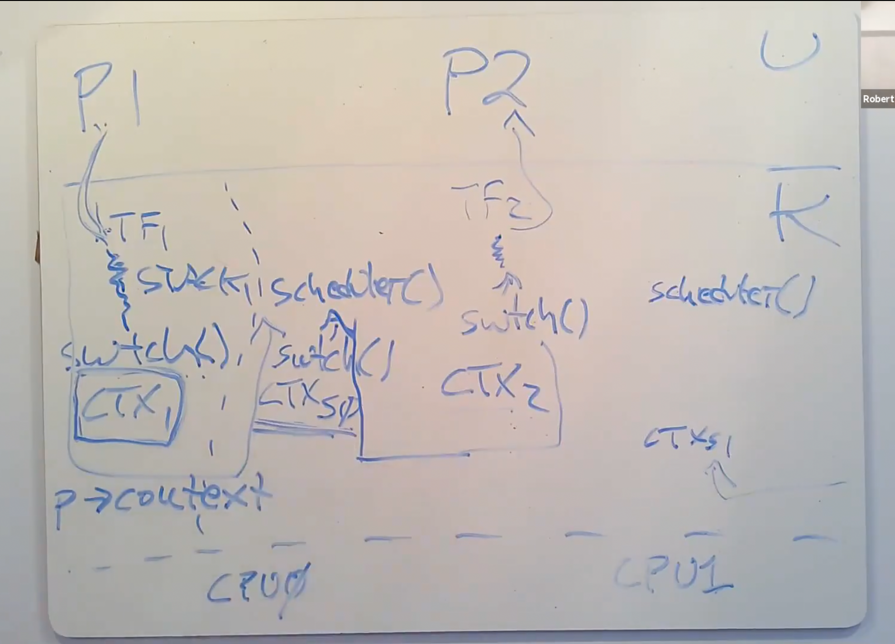

<!--more-->

# 6.S081 lec11: Thread Switching

**THREAD**: one serial execution
* PC, REGS, STACK

**Interleave**
* Multiple-core
* Switch among threads **each core**

**share memory?**
* xv6 kernel threads share kernel memory
* xv6 user processes - each has **only one thread** -> no share memory
* In Linux, multiple threads in a process -> shares memory

---

## Challenges

* Switching - interleave
  * Scheduling
* what to save/restore
* compute-bound threads
  * how to pause them

---

### Dealing w/ compute bound threads

Solution: timer interrupt

P1 interruptted by timer, save its state in **Trapframe**
call *swtch()* to switch the kernel context to **scheduler's context**

The scheduler thread state is saved **per core**, it then switches the context to P2's kernel thread's.

The P2's kernel thread **returns to userspace** and activate userlevel thread of P2. 