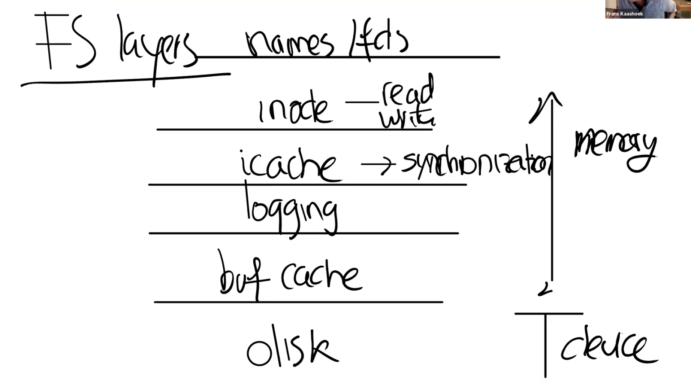
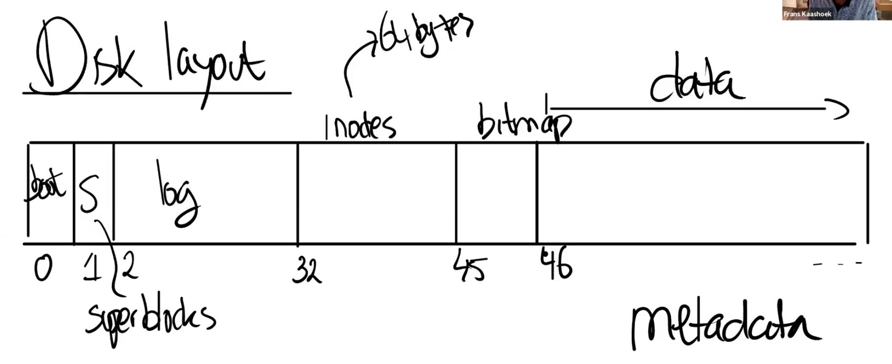
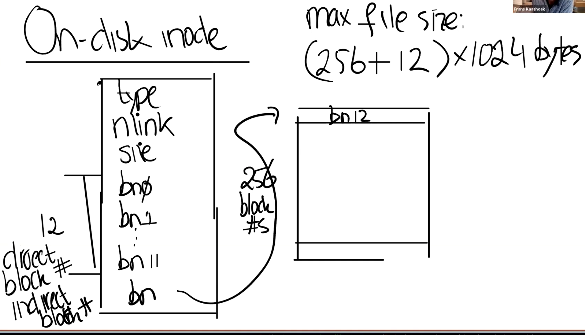

<div></div>

<!--more-->

# 6.S081 lec13,14,15 - File System

---

lock lab is quite a torture..... Took so much time debugging and rewriting the whole scheme.

Fortunately with the help of online resources, I figure out my problem was forgetting to double check the cache block. Let's get started!

**HELLO, FILESYSTEM!**

---

## Basics

### File syscalls

```c
fd = open("x/y", _);
write(fd, "abc", 3);
link("x/y", "x/z");
unlink("x/y");
```

* for write, **offset is implicit**
* for link, a file might have **multiple names**
  * and unlink, namespace for a file can change even when it is opened

---

### FS structure

#### Inode

* **file info, independent of name**
  * has link count, tracking names

* Name by **inode #**

* open fd count
  * Only **link count and open count are both zero** can it be closed
* an **offset** maintained

---

### FS layers



---

### xv6 disk layout

given the inode#, we can calc which block the inode resides



---

### ondisk inode



---

## Crash safety

1. kernel panics
2. Power crash during fs operations

---

### LOGGING

-- Divide the disk to (LOG + DATA)

​	-- Divide the log to log_header and log_block

​		-- log_header is used to check commits

1. atomic **fs syscalls**
2. fast recovery
3. high performance

#### Basic idea - steps

1. instead of writing to home block, writes to **LOGGING BLOCK** instead.

2. when the fs op is done, **COMMIT** the operation

3. install to home block
4. clean the log

* **IT USES THE ATOMICITY OF A BLOCK_WRITE TO ENSURE**

**WHEN REBOOTS**

1. check commit ops
2. If there are any, reinstall and clean log

---

### Complication

#### Eviction

When buffer cache evicts a block, which is caching the data of log. 

But the eviction writes the cache to the **HOME BLOCK**

* SOLUTION: don't evict the blocks that are in log
  * Uses`bpin()` - increments `b->refcnt`, so no eviction to it shall happen
  * When it is logged, `bunpin()` it

---

#### fs op must fit in log

the fs operation cannot **overflow** (use more than) the **total size** of the logging area

* SOLUTION: break big ops to small transactions
* Block cache must be bigger than log size

---


