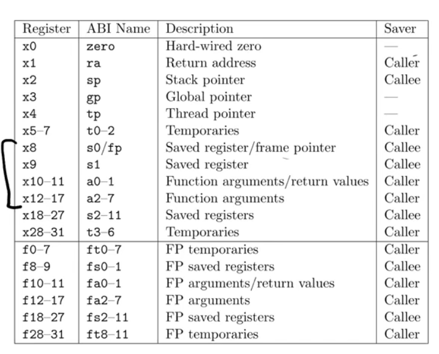

<style>
img{
    width: 70%;
}
</style>


<!--more-->

# 6.S081 lec5: RISCV calling conventions
---

## Caller Saved and Callee Saved
Registers are categorized as **caller saved** and **callee saved**. The difference between them is very important.



* **Caller Saved** registers are **not** reserved across function calls.
* **Callee Saved** registers are reserved across function calls. The caller has to find someway to save those registers.

The convention also states, the **return value** is in a0 and a1, and **arguments** of the function is in a0-a7.
* If more arguments are given, they should reside on stack.

---


## the Stack
* The stack is created by function call! **Each function call creates a stack frame for itself to use.**
* The stack starts from high address, growes down to low address. To make a new stack frame, decrement sp register.
* The stack size is **not fixed**, pay attention to the layout.
  * The return address is always at the first word
    * ```asm
        addi sp, sp, 16 # alloc stack frame
        sd ra, 0(sp)    # store the return address
        ...
        ld ra, 0(sp)    # recover the return address
        addi sp, sp, 16 # delete the stack frame
      ```
        * This also shows that why $ra is a **callee saved** register.
  * The Prev. Frame address is always next to return address, to control frame callback.


---

## GDB commands

* **To open the gdb mode of xv6**
  * In one window type **make qemu-gdb** to start the gdb server
  * In another window type **riscv-unknown-elf-gdb** to connect to the previous gdb server and start debugging!
  <br/>

* **layout split/asm/reg/src**
  * -> show the layout of (asm & src)/asm/reg/ src
  * **focus reg/asm**....
    * -> change the focus among windows
    <br/>

* **info**
  * **info breakpoints**
    * -> check the number of bp
  * **info frame**
    * -> check the info of current stack frame (frame 0)
    * **backtrace (bt)**
      * frame x -> info frame
        * -> change current frame to **x** and print the info
        <br/>

* **tui enable**
  * show the tui
  <br/>

* **breakpoint/watchpoint \<tag\>**
  * **delete \<bp_nr\>**
  * info breakpoints/watchpoints
  <br/>

* **s & si** (step instruction)

---

