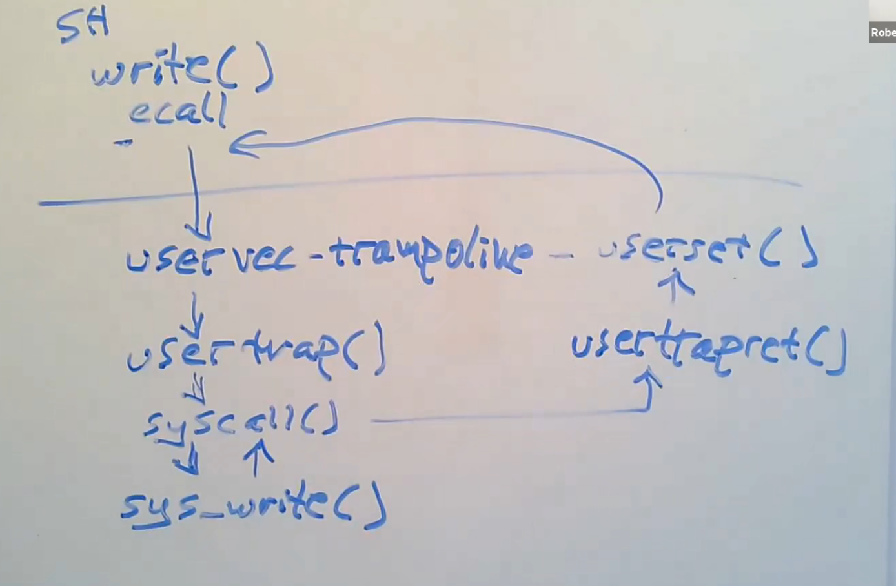

# 6.S081 lec6: Traps

From user space to kernel space

* Hardware state
  * 32 general-purpose regs
    * saved entirely
    * sp needs to be modifies later
  * pc, mode, satp
    * pc needs to be saved, mode needs to be set
    * **needs to be changed to kernel pgtbl**, user pgtbl does not have the mapping for kernel data
  * stvec
    * point to entry of trap
  * sepc
    * save pc when trap
  * sscratch
    * "tmp" usage reg when trap

---

## Supervisor mode

* R/W Control regs
  * satp, stvec, sepc, sscratch
* use PTEs that don't have the PTE_U flag set

supervisor mode can't do everything
 * e.g. It is forced to go through pgtbl as well.

---

## Shell calls to write()

* high level path

