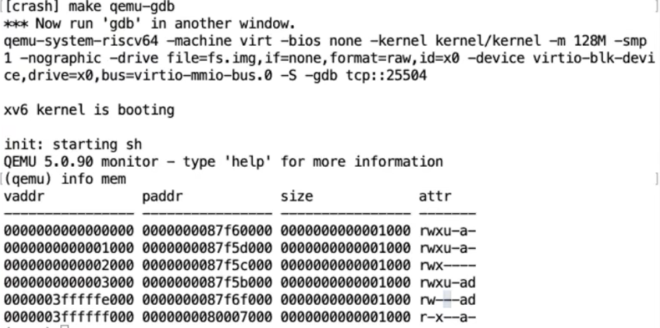

<style>
img{
    width: 80%;
}
</style>

<!--more-->

# 6.S081 lec6: Traps

From user space to kernel space

* Hardware state
  * 32 general-purpose regs
    * saved entirely
    * sp needs to be modifies later
  * pc, mode, satp
    * pc needs to be saved, mode needs to be set
    * **needs to be changed to kernel pgtbl**, user pgtbl does not have the mapping for kernel data
  * stvec
    * point to entry of trap
  * sepc
    * save pc when trap
  * sscratch
    * "tmp" usage reg when trap

---

## Supervisor mode

* R/W Control regs
  * satp, stvec, sepc, sscratch
* use PTEs that don't have the PTE_U flag set

supervisor mode can't do everything
 * e.g. It is forced to go through pgtbl as well.

---

## Shell calls to write()

* high level path


### gdb debugging the code

* In qemu-gdb, `^A + C` will get into qemu monitor
  * info mem will print the pgtbl
  
* text page, data page, guard page(no PTE_U bit), stack page, TRAPFRAME page and TRAMPOLINE page

---

After the kernel runs **ecall**, this is called by **write()**(in usys.S)
**ecall does three things**
* saves `pc` to `sepc`
* changes mode to `supervisor`
* jump to `stvec`

#### enters uservec()
* pc -> TRAMPOLINE page
  * the registers are the original one, cannot be modifies **until we have saved them**
  * save a0 to sscratch, save sscratch to a0
    * a0 now **points at TRAPFRAME**
    * sscratch saves a0
  

Since ecall does not switch pgtbl, the first instructions of trap needs to present in every user's pagetable. (By the TRAMPOLINE page)
* controlled by *stvec*
  * **before entering userspace, kernel** set it to 0x3ffffff000 (TRAMPOLINE)

---

**OK! After ecall, we jump to stvec's address, entering uservec()! Prepare for it.**

---

#### in uservec()
**TRAPFRAME page**
* **32 slots + some interesting values**
  * **kernel_satp, kernel_sp, kernel_trap, epc, kernel_hartid**
    * There are **previously setup** by kernel when mapping trapframe for each process.
  * 32 slots is to save register when trapping
* **before entering userspace, kernel** puts the address of the trapframe in sscratch.
  * since we swapped, sscratch and a0, now a0 points at the trapframe

```asm
(gdb) print/x $a0
$1 = 0x3fffffe000 # trapframe addr, used to be in sscratch

(gdb) print/x $sscratch
$2 = 0x2 # first argument of write() syscall, which is the fd 2
```

from info above, we know that the kernel_satp, sp, trap, epc, hartid are set by kernel **previously**

so in **uservec()**
```asm
...
ld sp, 8(a0)
ld tp, 32(a0) # core_nr: hartid
ld t0, 16(a0) # address of usertrap()
ld t1, 0(a0)  # pgtbl addr of kernel

csrw satp, t1 # from now on, the va are interpretted by kernel pgtbl
sfence.vma zero, zero

jr t0         # jump to usertrap()
```

##### One last thing!
Why don't we crash! 
**pc is holding some va, and we switched pgtbl from user's to kernel's**
Why the next instuction is correctly executed instead of some garbage being run.

**This is because the va of TRAMPOLINE is THE SAME in userspace and kernel space!!!! It is in 0x3ffffff000.**

This is so damn important, always keep this in mind!

---

**OK! WE ARE NOW EXITING FROM uservec(), GOING INTO usertrap()**

---

#### in usertrap() (C code)

* **First** change the *stvec* to *kernelvec()*
* **Second** save the *sepc* on TRAPFRAME
```asm
p->trapframe->epc = r_sepc();
```
  * this is because the usertrap() might jump to another user process, which may overwrite the sepc
* **Third**, check *scause* to figure out the cause of trap
  * **if syscall()**
    * `p->trapframe->epc += 4` ,because it **currently pointing at ecall**
    * **enable interrupt**, which was closed by RISC-V **trap** hardware
      * because some syscall might take a lot of time
    * **call syscall()**
      * put the return value in **trapframe->a0**, when we go back to userspace, the value in a0 will be restored by **userret()**, which will further be treated as return value

  * **if devintr()**
    * call devintr()

  * else **exception**
    * kill the process
* **finally**, if there is a timer interrupt, the process yields the CPU
  * **CALL usertrapret()**

---

**OK! FROM the last line of usertrap(), we enter the usertrapret(), and we have really done the things that a trap should have done. Now it's time to go back to userspace**

---

#### in usertrapret() (C code)

1. **turns of interrupt**
   1. because we are about to change *stvec* to user TRAMPOLINE, if an intr happens, it goes back to userspace with supervisor privilege
   2. *sret* opens interrupts
2. **fill in trapframe slot**
   1. satp, kernel_sp, *usertrap()*, hartid
3. **change SSTATUS reg**
   1. SPP controls the privilege mode when sret (clear it for user mode)
   2. SPIE controls whether the intr will be enable (set it for enabling)
```C
sret: set the pc <- sepc
w_sepc(p->trapframe->epc)
```
4. **switch the pgtbl to user's**
   1. but this has to be done in TRAMPOLINE, because only TRAMPOLINE are mapped both **in userspace and kernelspace**
    ```asm
    uint64 satp = MAKE_SATP(p->pagetable); // this is used as an argument
   
    uint64 fn = TRAMPOLINE + (userret - trampoline);
    ((void(*)(uint64, uint64))fn)(TRAPFRAME, satp);
    ```
    **READ THE FOLLOWING CAREFULLY!!!**
    2. if we change pgtbl here, next instruction will be garbage! because the pc mapped to another physical address in mapping other than TRAMPOLINE page. **ONLY IN TRAMPOLINE PAGE, THE MAPPING IS IDENTITY between USERSPACE AND KERNELSPACE**

FROM `fn(TRAPFRAME, satp)`, we jump into *userret()*

---

**WE JUMP TO TRAMPOLINE: userret() now, this happens by using a function pointer. The calculation of the address is `TRAMPOLINE + (userret - trampoline`**

---

#### in userret() (assembly code)
only in TRAMPOLINE page's code, we can change pgtbl between kernel and user.

The **very first** things we do here, is set our pgtbl to user's
```asm
csrw satp, a1
```
Next, we save user's a0 in sscratch, because we need to swap it with a0 at last when we finally go back to userspace
```asm
ld t0, 112(a0)
csrw sscratch, t0
```
Next, ld all regs out of the TRAPFRAME.
```asm
ld ra, 40(a0)
ld sp, 48(a0)
...
ld t6, 280(a0)
```

Swap *sscratch* and *a0*
```asm
cssrw a0, sscratch, a0
```

Now *sscratch* contains the original a0's value, i.e. the address of the TRAPFRAME
*a0* contains the original *sscratch*'s value, i.e. a0 (return value of syscall)

**Finally**, call *sret*, we set pc to sepc, set the mode to usermode, enable interrupt, and **WE ARE BACK IN USERSPACE, and moreover JUST AT WHERE WE CALLED ECALL (actually the next assembly inst since we +4 to epc)**

---

### IMPORTANT THINGS TO FIGURE OUT (PLEASE READ THIS!)

1. **Why do we need TRAMPOLINE page**

   The main reason for this is we need to **change pgtbl between kernel's and user's**. When we are running instructions, the pc holds a virtual address, but the actually instruction resides in **physically memory which corresponds to current pgtbl and va**. But when we change pgtbl, the virtual address is the same, but the physical address is not the same anymore.

---

2. **Why do we need TRAPFRAME page**
   
   I think this is because, when we enter the trampoline page, we are still in user's va space. However, we need to save the user's registers. **Given the context that, first we are using user's mapping, and second we gotta save the registers**, we need some space mapped in user process' pgtbl to save them. And this is the TRAPFRAME page.

---