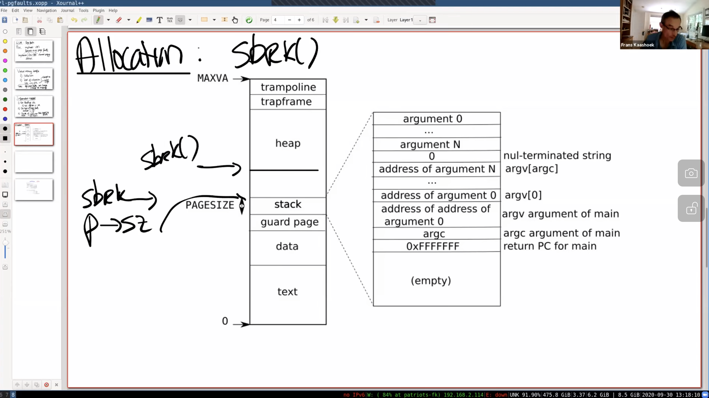
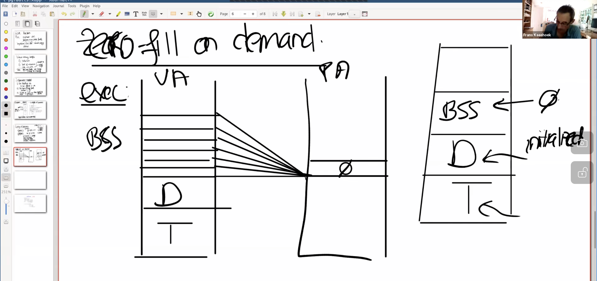
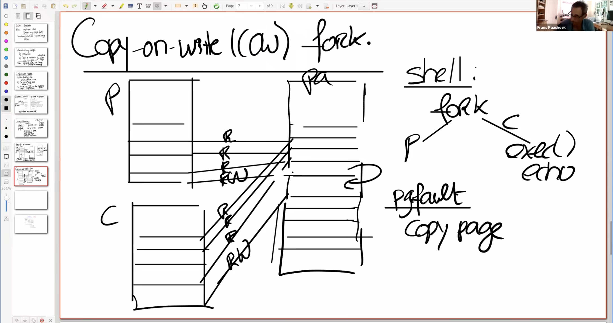
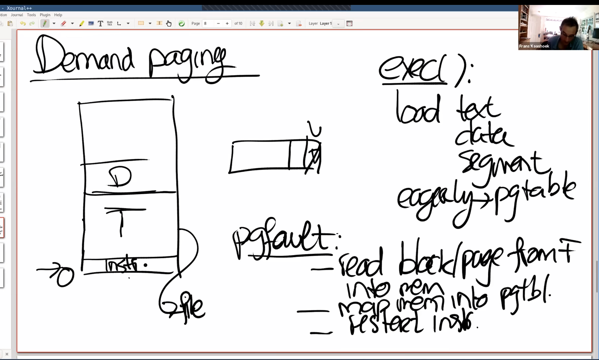

<style>
img{
    width: 80%;
}
</style>

# Lec8: Page Faults
---

<!--more-->

**PAGE FAULTS ARE EXCEPTIONS, using THE SAME MECHANISM as syscall, i.e. TRAP**

Using page fault, we can make mapping dynamic.
* implement VM features using Page Fault handler
  * lazy alloc
  * cow fork
  * mmap
  * demand paging
  
---

What we need for page fault
1. faulting virtual address
   1. the va is put in *stval* register
2. **type** of fault
   1. read, write and inst -> in *scause* register
3. the **va of instruction** that caused the Page Fault
   1. in *sepc* register, when ecall is called

---

## Allocation

`sbrk()` -> eager allocation: the mem is allocated asap
* applications tend to overask


### lazy allocation

When *sbrk()* is called, increment `p->sz += n`, but do not allocate memory.
* Causing page fault
  * When page fault, allocate if `va < p->sz` (stval has va)
    * allocate a page, zero it and map
      * then restart the original instruction transparently

In lazy page allocation, when a faulting va is accessed, we mapped a page.
But there is also **an important thing** we need to pay attention on, that is
when *uvmunmap()* is called.
```c
void
uvmunmap(pagetable_t pagetable, uint64 va, uint64 npages, int do_free)
{
  uint64 a;
  pte_t *pte;

  if((va % PGSIZE) != 0)
    panic("uvmunmap: not aligned");

  for(a = va; a < va + npages*PGSIZE; a += PGSIZE){
    if((pte = walk(pagetable, a, 0)) == 0)
      panic("uvmunmap: walk");
    if((*pte & PTE_V) == 0)
      // panic("uvmunmap: not mapped");  <----- this is the problem
      continue; // WHY? Because when sys_sbrk() is called, maybe more than one page is growed (p->sz += x*PGSIZE)
                // however, in lazy alloc, we only allocate **one** page when a faulting va is accessed
                // therefore, when the process exits. The lazily allocated mapping will cause panic
                // IF YOU ARE NOT CLEAR
                // read uvmunmap(), sys_sbrk(), mappages()
                // CORE:
                // keep in mind that the core is: sbrk() gives conceptually more than one page, 
                // but actually allocate one when page fault.
                // howevery uvmunmap() unmaps too many of them
    if(PTE_FLAGS(*pte) == PTE_V)
      panic("uvmunmap: not a leaf");
    if(do_free){
      uint64 pa = PTE2PA(*pte);
      kfree((void*)pa);
    }
    *pte = 0;
  }
}
```
The so called **an important thing** is stated in code section.

---

## zero-fill on demand


BSS is **zero-filled**, containing many pages with zero only. <- that's what we have in Virtual Address Space

But in PA, we only have **one page** filled with zero. And we map all BSS pages to the zero-filled physical page.
The physical page should not be **written-allowing**

When page fault, we kalloc() a new page, and map faulting page to the new one with R/W perm.

---

## COW fork()

First share the same physical page with parent.
* manipulate pte

When child want to modify some page, kalloc() a new page.
* for parent and child, PTE_R only
  * when page fault, kalloc() -> copy the original page, and map with PTE_W | PTE_R for both parent and child
    * check the figure to be more clear
  * How to find the faulting page for **parent**
    * the same va, since the child is a **duplicate**



**pgfault**
* copy page
* map it
* restart instruction
  * *userret*()

Flag bit in pte, the 8, 9, 10 bit (**RSW**) can be used for supervisor software.
* help kernel recognize whether it is a invalid access or COW

### exiting

a **ref count** for each physical page
* when a process stops referencing the page, `--refcount`, when refcount is zero, free the page.

---

## Demand Paging

In *exec()*, we do not eagerly load the text, data segment **from disk to mem** (expensive).

Instead, we set the PTE, but **without the PTE_V bit set, and do not actually load it**



**When page fault**
* read the block of data from file(disk) to mem
* map the memory into pgtbl
* restart instuction

**Benefit**:
* If program does not use all data/text segment, we use less memory. Load less from disk (faster)
* **Worst case**: a page fault for every page

### If Out-Of-Memory

*kalloc()* returns zero, running out of memory.
* -> **evict** a page to fs, use the **just-free** page ->restart

**WHICH one to evict tho?**
* Least-Recently used (LRU)
* Prefer **not-dirty** pages
  * We can do nothing more than **invalidate the page by setting the PTE_V to 0**
  * If dirty page is evicted, we may have to write it back **twice**
* Prefer **not-recently-accessed** page
  * PTE_A bit is used to impl LRU strategy
    * reset PTE_A bit every once in a while

---

## memory mapped files (mmap)

`mmap(va, len, prot, flags, fd, off)`
map file descriptor `fd` with offset `off` to a virtual address `va`, with protection `prot` and `flags`

kernel copy `len` bytes from `offset` into memory, setting pte to the physical memory.
From now on, application use load and store to modify file.

`unmap(va, len)`, to write back the **dirty blocks**

### do it lazily

do not map the file immediately
**keep a record**, PTE belongs to fd, saved in VMA (virtual mem area)

When page fault, load disk from mem

---

