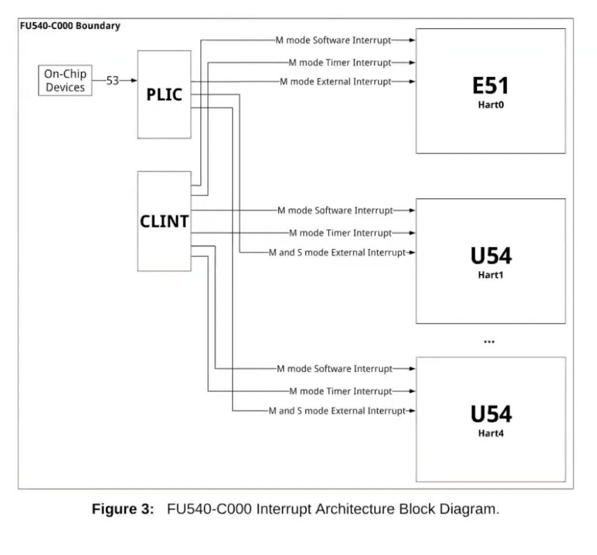
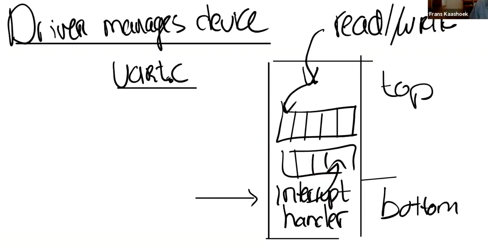

<style>
img{
    width: 80%;
}
</style>

<!--more-->

# 6.S081 lecture9: Interrupts

## Interrupts
Hardware wants attention now.

SW saves its work
* set it aside
* process interupt
* resume

**same mechanism** w/ syscall and traps

---

## Properties of Interrupt
Three things **differs** Interrupt from others
**Interrupt**
* asynchronous
    * may have nothing to do with CPU's context
* concurrency
* programmed devices

---

## Hardware side
**PLIC** controls interrupts by **routing** them to cores
When no cores are available, PLIC **holds** them.



---

## Software side
code manages the device is called **driver**

**Driver structure**
* Top part (interact with user level processes)
  * **queue** running in the driver, decouples top and bottom
* Bottom part
  * Interrupt handler



---

## Programming device

Typically done by **memory mapped io**.
* devices show on specfic physical addresses
* ld/st inst to those addresses
  * read, write **control regs** of the device 

---

## Case study: $ ls

* $: device puts $ into **UART**
  * UART generates interrupt when the character has been sent
  * UART是用于串口通信的芯片

* ls: keyboard to the recv line
  * generate interrupts to tell there a char available
  * handler reads it

### RISC-V support for interrupts

**SIE**: supervisor interrupt enable reg 
* 1 **bit** each for external intr, sw intr, timer intr

**SSTATUS**
* 1 **bit** to disable and enable intr

**SIP**: supervisor pending register
* what intr comes in

**scause**
* indicate it is an interrupt

**stvec**
* jump to handler

---

## Interrupt (HW)

Let's say the **keyboard raises the intr line**
-> The intr signal goes to **PLIC**
-> The PLIC routes the signal to **core**

* If the core's SIE bit is set
  * close the INTR by **clearing SIE bit**
  * epc <- pc
  * save the current mode
  * mode <- supervisor
  * pc <- stvec
    * *usertrap()*
  
---

## Interrupt and concurrency

1. device and CPU run in **parallel**
   1. **producer/consumer parallelism**
2. interrupt stops current runnning program
   1. tricky when **kernel** gets interrupt
   2. intr enable/disable
3. **top of driver and bottom** of the driver may run in parallel **(on different CPUS)**
   1. use **locks**, because different CPU may look at the **same** queue.

---

### producer-consumer parallelism

A **buffer** in the driver.
Two **ptrs**, read ptr and write ptr.

Producers: *putc()*
Consumers: *getc()*

buffer full? buffer empty?

```C
char uart_tx_buf[UART_TX_BUF_SIZE];
int uart_tx_w;
int uart_tx_r;
```

### procedure of inputting 'l'

User inputs char **l** 
-> **l** sent from **keyboard to UART**
-> routed through **PLIC** to some **core**
-> interrupt, *devintr()* is called
-> *uartintr()* is called
-> *uartgetc()* gets the char input (i.e. 'l'), then called *consoleintr()*
-> *consputc()* is called to show the char
-> put the char into the buffer, and when a **newline** is called, *wakeup()* the shell to read the buffer

### Interrupt Evolution

* Used to be fast
  * hw simple
* Now intr slow compared to **CPU**
  * device is more complex
    * to avoid intr too much

e.g. gbit eth card -> 1.5mill pkts/s 
* If intr per packet, too many interrupts
* Used **polling** to solve for **fast devs**

#### Polling

If the dev is very fast, the cost of intr is high

CPU **spins**(loop) on dev, until dev has data
* waste CPU cycles if the dev is slow
* but if dev is fast, it's ok
  * saves entry/exit cost

---


