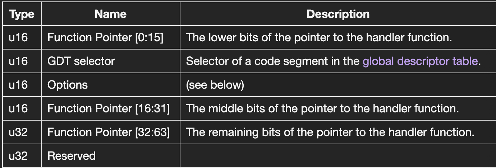
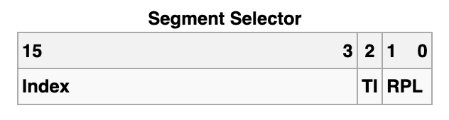
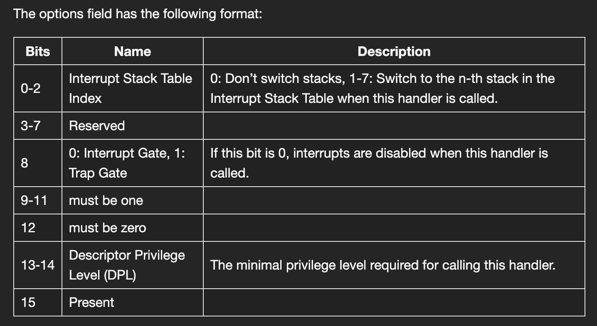
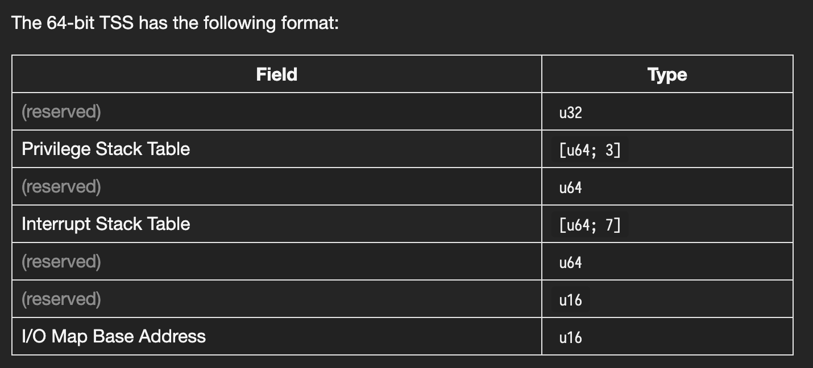

<div></div>

<!--more-->

# GDT, IDT, Descriptor, Selector

[toc]

## GDT IDT Descriptor以及Selector

废话不说，我们先来看代码**(From phil-opp's blog_os repo)**

IDT的结构如下：

```Rust
#[repr(C)]
pub struct InterruptDescriptorTable {
    pub divide_by_zero: Entry<HandlerFunc>,
    pub debug: Entry<HandlerFunc>,
    pub non_maskable_interrupt: Entry<HandlerFunc>,
    pub breakpoint: Entry<HandlerFunc>,
    pub overflow: Entry<HandlerFunc>,
    pub bound_range_exceeded: Entry<HandlerFunc>,
    pub invalid_opcode: Entry<HandlerFunc>,
    pub device_not_available: Entry<HandlerFunc>,
    pub double_fault: Entry<HandlerFuncWithErrCode>,
    pub invalid_tss: Entry<HandlerFuncWithErrCode>,
    pub segment_not_present: Entry<HandlerFuncWithErrCode>,
    pub stack_segment_fault: Entry<HandlerFuncWithErrCode>,
    pub general_protection_fault: Entry<HandlerFuncWithErrCode>,
    pub page_fault: Entry<PageFaultHandlerFunc>,
    pub x87_floating_point: Entry<HandlerFunc>,
    pub alignment_check: Entry<HandlerFuncWithErrCode>,
    pub machine_check: Entry<HandlerFunc>,
    pub simd_floating_point: Entry<HandlerFunc>,
    pub virtualization: Entry<HandlerFunc>,
    pub security_exception: Entry<HandlerFuncWithErrCode>,
    // some fields omitted
}
```

Entry的结构如下：

```Rust
#[repr(C)]
pub struct Entry<F> {
    pointer_low: u16,
    gdt_selector: u16,
    options: EntryOptions,
    pointer_middle: u16,
    pointer_high: u32,
    reserved: u32,
    phantom: PhantomData<F>,
}
```

IDT其实就是中断向量表，当中断/exception发生的时候，系统根据对应的exception前往IDT寻找handler的地址，然后跳转到handler进行对应exception的处理，处理之后再返回，**具体的IDT中每一个entry**的格式如下



当Exception发生时，具体做了这些

> 1. Push some registers on the stack, including the instruction pointer and the [RFLAGS](https://en.wikipedia.org/wiki/FLAGS_register) register. (We will use these values later in this post.)
>
>    (将寄存器推到栈上)
>
> 2. Read the corresponding entry from the Interrupt Descriptor Table (IDT). For example, the CPU reads the 14-th entry when a page fault occurs.
>
>    （将对应的entry得到)
>
> 3. Check if the entry is present. Raise a double fault if not.
>
>    (如果没有handler，产生Double fault)
>
> 4. Disable hardware interrupts if the entry is an interrupt gate (bit 40 not set).
>
> 5. Load the specified [GDT](https://en.wikipedia.org/wiki/Global_Descriptor_Table) selector into the CS segment.
>
>    (将GDT读进CS段寄存器)
>
> 6. Jump to the specified handler function.

可以看到，我们最主要的是需要得到entry的

1. 函数地址
2. GDT Selector
3. Options

### GDT Selector

首先我们来看GDT Selector，每一个**Segment Selector其实是一个16位的数据结构**

先来看他的格式是怎么样的



TI: 0/1 在LDT/GDT中进行索引，RPL与Privileged Level有关，而Index则是关键

**由这个Index，我们可以在LDT/GDT中进行索引，得到对应的Segment Descriptor**

而Segment Descriptor又是什么？我们平时在分段式的内存分布中，看到的不都是CS:PC这种吗

Segment Descriptor其实就和他的名字一样，是Describe the Segment的东西，他包含了这个Segment的base，limit等信息

**因此**

1. 在我们获得了entry之后，我们就可以得到对应的Segment Selector
2. 然后通过它，我们就可以在GDT中得到对应的Segment Descriptor

这样我们就可以得到对应的段地址和长度了

### Options

然后我们来看看Options，我们在IDT中设置的Index，可以让我们在interrupt发生的时候，由GDT->TSS->IST，然后切换stack



## TSS

那什么又是TSS呢，TSS其实在最开始的OS中有别的用途，这里我们不关心，我们来看他现在的用途



可以看出，我们有对应的IST表，我们给对应的Interrupt **Option**设置了对应的Index后，**在Interrupt发生之后，他就会自动将栈指针切换到这个IST[index]中**，这样就可以防止在Double Fault的时候仍然产生Page Fault的情况，导致Triple Fault的发生


**与上面结合，其实GDT中也包含了TSS_selector，帮助在Interrupt的时候找到对应的TSS，进而找到对应的IST**

---

## 总结

因此，我们在重新设置GDT的时候需要做这些事情

1. 首先把GDT load进CPU中，使用汇编

```asm
lgdt
```

2. 尽管如此，我们的各种段寄存器比如CS，仍然保存的是之前的GDT的内容，因此我们需要对我们需要的那些段寄存器进行覆写

```Rust
unsafe {
    CS::set_reg(GDT.1.code_selector);  // overwrite CS reg
  
    // overwrite tss (using ltr instuction)
    load_tss(GDT.1.tss_selector);
}
```

3. 对于IDT，我们需要对他们entry的option进行设置，让interrupt发生的时候切换到对应的IST上
   1. 具体的流程应该是，发生Exception -> 由Option得到IST index -> 读取GDT -> 读取TSS -> 在TSS中找到IST[index]，这就是对应的Stack，然后切过去就好了


---

综上我们可以这么说，对于IDT来说，我们需要GDT Selector得到CS段寄存器，需要Option来得到IST(栈表)的下标

我们得到的任何一个Selector，都可以让我们直接从GDT/LDT中得到对应的Descriptor，包含有对应的段的信息，TSS也有对应的Descriptor
