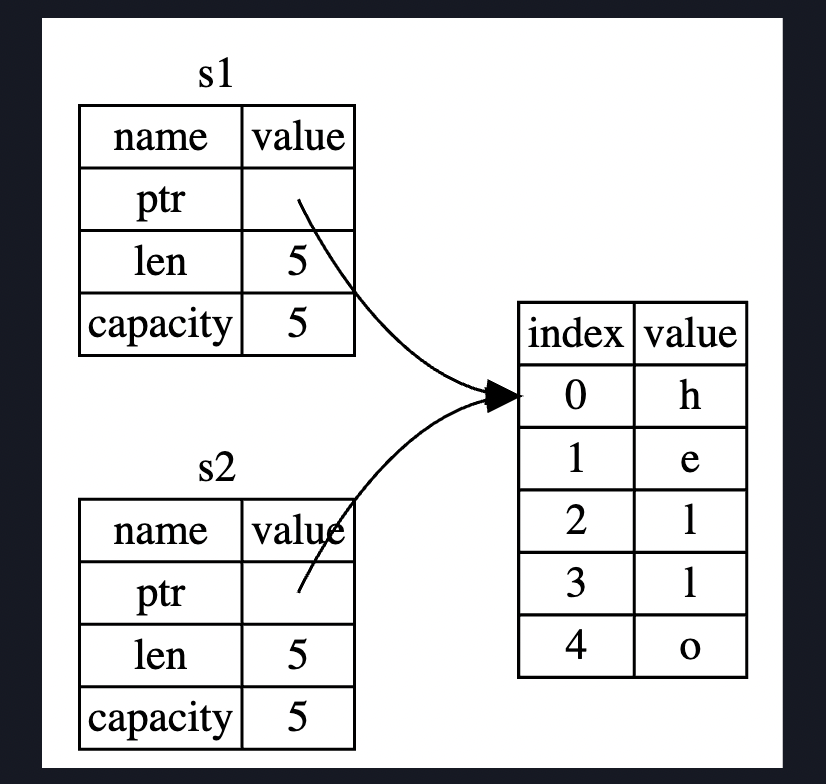

<style>
img{
    width: 80%;
}
</style>


<!--more-->

# Ownership

**所有权规则**:
1. 每一个值，都有一个被称为其owner的变量。
2. 值在任意时刻只有一个owner
3. 当owner离开作用域的时候，这个值将被丢弃

所有权机制可以更好的管理**堆**上的数据。

---

## String类型
```Rust
fn main() {
    let mut s = String::from("hello");

    s.push_str(", world!"); // push_str() 在字符串后追加字面值

    println!("{}", s); // 将打印 `hello, world!`
}
```

String分配在**堆上**，是可变的。
由于ownership，资源在变量生命周期结束时就被释放了。

### 变量与数据交互的方式（一）：移动

```Rust
let s1 = String::from("hello");
let s2 = s1;
```

实际上在内存发生的是这件事


前面说，当变量离开作用域后，Rust调用`drop`函数清理变量的堆内存。但是如果s2离开了，我们释放了堆内存，那么s1呢？
这就导致了double free的问题。

因此
**Rust在let s2 = s1之后，s1不再是一个有效的变量**, 这相当于我们将变量s1的所有内容给予了s2，而s1不再有效，是一种**移动**的语义。

如果我们使用这段代码
```Rust
let s1 = String::from("hello");
let s2 = s1;
println!("{}, world!", s1);
```
会报错，因为Rust禁止使用无效的引用。

同时这也说明，Rust**永远不会自动地创建数据的deepcopy**。

### 变量与数据交互的方式（二）：克隆(clone)
```Rust
let s1 = String::from("hello");
let s2 = s1.clone()
```
这段代码中，s1, s2都是有效的，因为我们使用的是clone，**堆上的内存也被复制了**。

### 栈上的数据：拷贝
```Rust
let x = 5;
let y = x;

println!("x = {}, y = {}", x, y);
```
这段代码中，x与y都是有效的，因为在**栈上的数据的拷贝是快速的**，因此我们没有必要在创建y之后让x无效。

### copy trait!!!
Rust 有一个叫做 `Copy trait` 的特殊注解，可以用在类似整型这样的存储在栈上的类型上。
**如果一个类型实现了 `Copy trait`，那么一个旧的变量在将其赋值给其他变量后仍然可用。**
Rust 不允许自身或其任何部分实现了 `Drop trait` 的类型使用 `Copy trait`。
如果我们对其值离开作用域时需要特殊处理的类型使用 Copy 注解，将会出现一个编译时错误。

p.s. **copy trait一般用于分配在栈上的变量，drop用于回收堆上内存**

### 所有权与函数

向函数传递值的时候，如赋值语句一般，可能会发生**移动或者拷贝**，这跟变量的类型以及所在内存的位置有关。

下面这段代码需要注意的是，在`takes_ownership(s)`之后，s就变得无效了
而x仍然是有效的。

```Rust
fn main() {
    let s = String::from("hello");  // s 进入作用域

    takes_ownership(s);             // s 的值移动到函数里 ...
                                    // ... 所以到这里不再有效

    let x = 5;                      // x 进入作用域

    makes_copy(x);                  // x 应该移动函数里，
                                    // 但 i32 是 Copy 的，所以在后面可继续使用 x

} // 这里, x 先移出了作用域，然后是 s。但因为 s 的值已被移走，
  // 所以不会有特殊操作

fn takes_ownership(some_string: String) { // some_string 进入作用域
    println!("{}", some_string);
} // 这里，some_string 移出作用域并调用 `drop` 方法。占用的内存被释放

fn makes_copy(some_integer: i32) { // some_integer 进入作用域
    println!("{}", some_integer);
} // 这里，some_integer 移出作用域。不会有特殊操作
```

### 返回值与作用域

返回值也可以转移所有权
```Rust
fn main() {
    let s1 = gives_ownership();         // gives_ownership 将返回值
                                        // 移给 s1

    let s2 = String::from("hello");     // s2 进入作用域

    let s3 = takes_and_gives_back(s2);  // s2 被移动到
                                        // takes_and_gives_back 中,
                                        // 它也将返回值移给 s3
} // 这里, s3 移出作用域并被丢弃。s2 也移出作用域，但已被移走，
  // 所以什么也不会发生。s1 移出作用域并被丢弃

fn gives_ownership() -> String {             // gives_ownership 将返回值移动给
                                             // 调用它的函数

    let some_string = String::from("hello"); // some_string 进入作用域.

    some_string                              // 返回 some_string 并移出给调用的函数
}

// takes_and_gives_back 将传入字符串并返回该值
fn takes_and_gives_back(a_string: String) -> String { // a_string 进入作用域

    a_string  // 返回 a_string 并移出给调用的函数
}
```

那如果**我们想不获取所有权的**使用一个值该怎么做呢
1. 我们可以传进来再返回
```Rust
fn calc_length(s: String) -> (String, usize) {
    let length = s.len();

    (s, length)
}
```

## 2.使用引用(reference)
```Rust
fn main() {
    let s1 = String::from("hello");

    let len = calculate_length(&s1);

    println!("The length of '{}' is {}.", s1, len);
}

fn calculate_length(s: &String) -> usize { // s 是对 String 的引用
    s.len()
} // 这里，s 离开了作用域。但因为它并不拥有引用值的所有权，
  // 所以什么也不会发生
```

reference的关系是这样的


我们可以使用`let len = calculate_length(&s1)`来使用

我们使用reference后**允许使用值**，**但不允许获得所有权**。

引用同样是默认**不可变的**，如果我们需要在函数中改变引用的值，我们需要使用可变引用

可变引用的签名如下:
```Rust
fn main() {
    let mut s = String::from("hello");

    change(&mut s); // here has to be aligned with the func
}

fn change(some_string: &mut String) {
    some_string.push_str(", world"); // This is ok now
}
```

* 可变引用有一个限制，那就是同一时间，**对于一个数据只有能有一个可变引用**
```Rust
let r1 = &mut s;
let r2 = &mut s;
```
这段代码会报错。

这可以避免racing
* 两个或更多指针同时访问同一数据。
* 至少有一个指针被用来写入数据。
* 没有同步数据访问的机制。

```Rust
fn main() {
let mut s = String::from("hello");

{
    let r1 = &mut s;

} // r1 在这里离开了作用域，所以我们完全可以创建一个新的引用

let r2 = &mut s;
}
```

同时，**我们不可以在拥有不可变引用的同时拥有可变引用**，因为拥有不可变引用的用户不希望自己的值被别人改变。
```Rust
let mut s = String::from("hello");

let r1 = &s; // 没问题
let r2 = &s; // 没问题
let r3 = &mut s; // 大问题

println!("{}, {}, and {}", r1, r2, r3);
```

一个引用的作用域是**从声明，到最后一次使用为止**
因此下面的代码是ok的
```Rust
let mut s = String::from("hello");

let r1 = &s; // 没问题
let r2 = &s; // 没问题
println!("{} and {}", r1, r2);
// 此位置之后 r1 和 r2 不再使用

let r3 = &mut s; // 没问题
println!("{}", r3);
```

### 悬挂引用 Dangling References
悬挂指针是指，在释放内存时，保留了指向那块内存的指针。
在Rust中，编译器确保引用永远不会Dangle
**当你拥有数据的reference时，编译器确保数据不会在引用前离开作用域**

```Rust
fn main() {
    let reference_to_nothing = dangle();
}

fn dangle() -> &String { // dangle 返回一个字符串的引用

    let s = String::from("hello"); // s 是一个新字符串

    &s // 返回字符串 s 的引用
} // 这里 s 离开作用域并被丢弃。其内存被释放。
  // 危险！
```

## Slice 类型
slice是另一个**没有所有权**的数据类型，用于**引用集合中一段连续的元素序列**
```Rust
fn main() {
let s = String::from("hello world");

let hello = &s[0..5];
let world = &s[6..11];
}
```

```Rust
fn main() {
fn first_word(s: &String) -> &str {
    let bytes = s.as_bytes();

    for (i, &item) in bytes.iter().enumerate() {
        if item == b' ' {
            return &s[0..i];
            // return i if we do not have slice
        }
    }

    &s[..]
}
}
```

```sh
$ cargo run
   Compiling ownership v0.1.0 (file:///projects/ownership)
error[E0502]: cannot borrow `s` as mutable because it is also borrowed as immutable
  --> src/main.rs:18:5
   |
16 |     let word = first_word(&s);
   |                           -- immutable borrow occurs here
17 |
18 |     s.clear(); // error!
   |     ^^^^^^^^^ mutable borrow occurs here
19 |
20 |     println!("the first word is: {}", word);
   |                                       ---- immutable borrow later used here
```
可以看到，`clear`需要一个可变引用，但是word是一个不可变引用，Rust不允许他们同时存在，防止我们的word成为**空字符的引用**。

### 字符串的字面值本身就是slice
`let s = "Hello, world!"`
这里`s`的类型是`&str`，而`str`是在binary prog特定位置的字符串的一部分，因此我们可以解释为什么**字符串字面值是不可变的**，因为`&str`是不可变引用。

### slice作为参数
注意下面`first_word()`的函数签名，他的参数是`&str`，这允许我们使用`String或者&str`，
* 如果是String，我们传入String的slice或者reference
* 如果是&str，我们直接传入

```Rust
fn first_word(s: &str) -> &str {
    let bytes = s.as_bytes();

    for (i, &item) in bytes.iter().enumerate() {
        if item == b' ' {
            return &s[0..i];
        }
    }

    &s[..]
}
fn main() {
    let my_string = String::from("hello world");

    // first_word 中传入 `String` 的 slice
    let word = first_word(&my_string[..]);

    let my_string_literal = "hello world";

    // first_word 中传入字符串字面值的 slice
    let word = first_word(&my_string_literal[..]);

    // 因为字符串字面值 **就是** 字符串 slice，
    // 这样写也可以，即不使用 slice 语法！
    let word = first_word(my_string_literal);
}
```

### 其他类型的slice
```Rust
fn main() {
    let a = [1, 2, 3, 4, 5];

    let slice = &a[1..3];

    assert_eq!(slice, &[2, 3]);
}
```