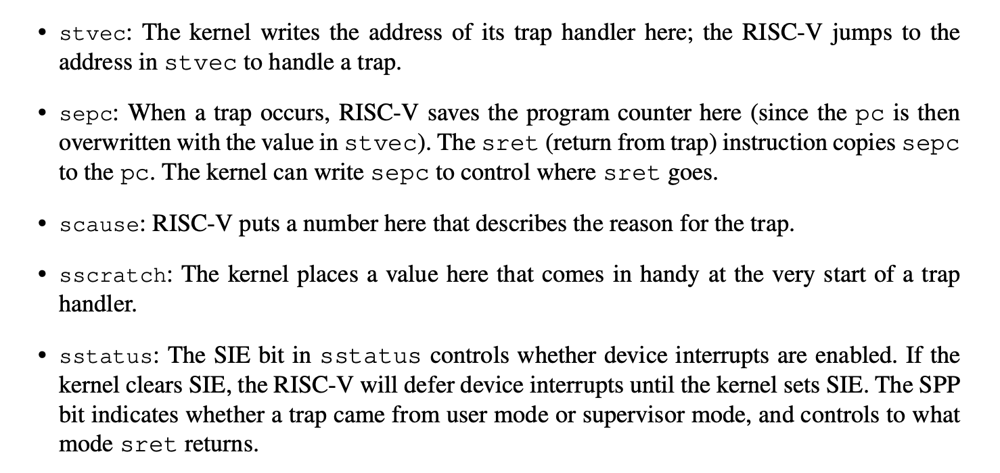

# xv6 book - Traps and syscall
---

<style>
img{
    width: 60%;
}
</style>

## Trap
There are three events cause CPU to trap
  * ecall
  * exception
  * device interrupt
  
Trap stages (4 in total)
  * hardware actions (from CPU)
  * assembly instructions, to prepare the way for kernel C code (**called vector**)
  * C function to handle the trap (**called handler**)
  * system call/device driver service routine

It is convenient to have separate code for different paths 
  * from user space
  * from kernel space
  * timer interrupts
  
---

## RISC-V trap machiery

* Control regs (some) for RISC-V
  * these regs cannot be written in user mode.
  * in machine modes, similar set of regs are used -> only for timer interrputs.



* Steps when trap happens **in hardware!!!**
  
  1. If the trap is device interrupt, clear SIE bit and do nothing following.
  2. Disable interrupts, i.e. clear the SIE bit in *sstatus*
  3. Copy pc to sepc
  4. Save current permission (user or supervisor) in SPP
  5. Set scause
  6. Set mode to supervisor
  7. Copy stvec to pc
  8. Start executing at new pc
  * The CPU does not switch to kernel pgtbl, does not switch to kernel stack, does not save any regs **other than pc**, which means **all these jobs are done by kernel software!!!**
* This gives more flexibility to kernel software
* pc is always saved and changed because, if pc is not changed but the permission is changed from user to supervisor, a user process could run user commands in supervisor privilege, which is very dangerous.
  
---

## Traps from user space

Cases:
* ecall
* does sth illeagl
* device interrupts

Highlevel path:
* uservec(trampoline.S:16) -> usertrap(trap.c:37) -> usertrapret(trap.c:90) -> userret(trampoline.S:88)
  
**The trampoline page does the magic.**
* The pc that stvec contains must have a mapping in all user pagetables!
  * Because the hardware does not change the pgtbl
* After that, the handling code switch the pgtbl to kernel pgtbl, and in order to continue executing, the handler code must be mapped also in kernel page table!
* **The trampoline page(PTE_U set) is in both kernel pgtbl and every process' pgtbl, containing the handler codes!**

---

### uservec (in process pgtbl)
*sscratch* reg helps to store process regs!
* process' regs need to be stored somewhere in memory. And to store the memory, a register is needed to store the address! (no **general-perpose reg** offered in RISC-V)
* *sscratch* does the magic!
   ```asm
    csrrw a0, sscratch, a0 # swap the content
    ```
  now uservec has **a0** to play with!

#### store the regs!
Before entering user space, kernel **set sscratch to point to a per-process trapframe, which is also mapped in user space pgtbl**
* For user process, the trapframe is high in address space.
* For kernel, the trapframe is in p->trapframe, pointing at its physical address.
so both can use trapframe.

**Now a0 points to the current process's trapframe, and all regs are saved in the trapframe**

After saving, the *uservec* retrives the address of kernel pgtbl, address of *usertrap()* and call it.

---

## usertrap (in kernel pgtbl)

job: determine the cause of the trap(ecall?interrupt?exception?) -> process it -> return

1. we now in kernel space, set *stvec* to *kernelvec*. So the trap in kernel will be handled in kernelvec, rather than in uservec
2. save the sepc (previously saved user's pc). This is because *usertrap()* might call *yield()*(caused by timer interrupt) to switch to another process's kernel thread, in whichi the sepc might be modified.
   
Three cases of trap:
* systemcall(ecall)
  * call syscall to handle it
* dev interrupt
  * call devintr
* otherwise (exception)
  * kill the process

After handling, *usertrap()* checks
1. whether the process is killed
2. whether the process should yield the CPU

Then, **call usertrapret()**

---

## usertrapret()
sets up the RISC-V control regs to prepare for a future trap from user space.
1. changing stvec to usertrap()
2. setting sepc to previously saved user pc
3. calls userret() on the trampoline page

```c
uint64 fn = TRAMPOLINE + (userret - trampoline)
((void (*)(uint64, uint64))fn)(TRAPFRAME, satp)
```

The code **casts** fn to a function pointer, pointing at a function which has a void return value and two uint64 arguments.

The fn is the entry address of the function, namely the entry address of userret in trampoline.

To be more clear, the TRAMPOLINE is the **start address of Trampoline page**, and we need to add the offset of userret(). The offset is userret - trampoline, externly declared as two char arrays.

---

## userret()

From usertrapret(), two arguments TRAPFRAME and satp are in register **a0 and a1**.

using `csrw satp, a1`, userret() restores the user pgtbl.

Then it 
1. save the saved user a0 in sscratch 
    ```
      ld t0, 112(a0)    # save a0(contains return value of syscall for example) to t0
      csrw sscratch, t0 # save t0 to sscratch
    ```
   1. note that now **a0 contains the address of the user's TRAPFRAME**
2. restore all registers but a0
3. swap the a0 and sscratch `csrrw a0, sscratch, a0`
   1. after this, ***a0 contains original user's a0, sscratch contains the address of TRAPFRAME***
4. call `sret` to return to user space.

---

### Details of system call

#### procedures

initcode.S invokes *exec* system call, we start from here.

```asm
# Initial process that execs /init.
# This code runs in user space.

#include "syscall.h"

# exec(init, argv)
.globl start
start:
        la a0, init
        la a1, argv
        li a7, SYS_exec
        ecall

# for(;;) exit();
exit:
        li a7, SYS_exit
        ecall
        jal exit

# char init[] = "/init\0";
init:
  .string "/init\0"

# char *argv[] = { init, 0 };
.p2align 2
argv:
  .long init
  .long 0
```
* initcode.S places arguments of exec in **a0 and a1**, and puts the system call number in **a7**
* then the *ecall* instruction cause the O/S to trap into *uservec()*
  * Recap: the uservec stores the registers in TRAPFRAME, change to kernel pgtbl and jump to usertrap()
* then the uservec calls usertrap(), the usertrap calls syscall()
  * from a7, knows which syscall to run
  * from a0 and a1 knows the argc and argv
* after sys_exec returns, p->trapframe->a0 has the return value
* In userret(), the trapframe->a0 is restored to actual a0, as return value.
  
#### syscall arguments

In userspace, user calls the wrapper function of syscalls. 

When in kernel space, the kernel needs to find the arguments in where they reside -> registers.
* Through *argint, argaddr, argfd*, kernel finds n'th syscall argument **from TRAPFRAME** as int, ptr, fd. They all call *argraw*, retrieving the trapframe regs.

**Another Problem**
* The argument may be malicious, not pointing to its own memory
* kernel pgtbl are not the same as user pgtbl, so kernel cannot use directly user-supplied addr.

**Solution**:
* kernel impl functions safely transfer data **to and from** user-supplied addresses
* for example:
  * *copyinstr() (vm.c:398)* copies *max* bytes to *dst* from *va srcva* in **user's pagetable**.
    * Since user's pgtbl is not current, *copyinstr()* use walkaddr() to look up the user's va in user's pgtbl
      * the function call yields the pa 
      * the function call checks the va is part of the process's address space
  * copyout() is similar

**To wrapup, the kernel implements *copyin(), copyout(), etc.*, to safely uses the user-supplied address.**

---

## Traps from kernel space

When traps happen in kernel space, *stvec* is already pointing at *kernelvec()*, so the pgtbl does not need to be changed.

* *kernelvec()*
  * saves the registers on the kernel stack
  * jumps to *kerneltrap()* (trap.c:134)
    * type1: dev interrupt
      * devintr()
    * type2: exceptions
      * panic()
  * restores the registers, and call *sret*
    * which copies sepc to pc

### stvec and interrupts
When trap comes from userspace, *usertrap()* sets stvec to *kernelvec()*. But there is a window of time when the kernel has started executed, but stvec is still set to uservec.

At this time, no dev interrupt should happen, so RISC-V always disable interrupts when trap happens, and xv6 does not enable them again **until after it sets *stvec***

---

