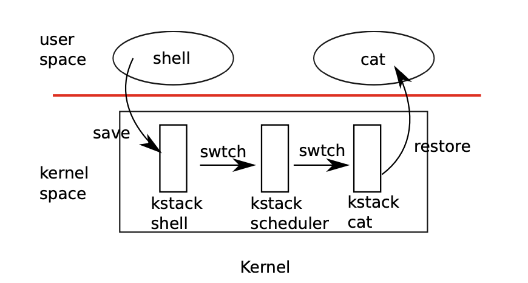

<div></div>

<!--more-->


# xv6-chap7-Scheduling

---

Processes are freed by their parents by *wait()*

* they cannot free their kernel stack while still using it

## How xv6 does it




* scheduler thread is **per-CPU**

* CALLING FLOW
  * yield() -> sched() -> swtch(), return to *scheduler()*
  * swtch() called by scheduler
  * trap return to userspace

---

### scheduling

Process

* holds `p->lock`, no other locks can be held
* update its `p->state`
* call `sched()`
  * only here the kernel thread gives up a CPU
* sched() double checks it, call `swtch()` to **scheduler thread**
  * this returns to scheduler thread, in its loop

---

### coroutines

>  Procedures that intentionally transfer control to each other via thread switch are sometimes referred to as *coroutines*;

In this example, sched and scheduler are **co-routines** of each other.

---

### How the first process does it

* *allocproc()* set *ra* to *forkret()*
  * the first *swtch()* that process called returns to *forkret*
* forkret() calls usertrapret() to returns to userspace

---

## Sleep and Wakeup in semaphore

```C
void
V(struct semaphore *s)
{
   acquire(&s->lock);
   s->count += 1;
   wakeup(s); // wakeup the sleeping processes
  						// causing their sleep() to return
   release(&s->lock);
}
void
P(struct semaphore *s)
{
  while(s->count == 0)
		sleep(s); // gives up the CPU actively
  acquire(&s->lock);
  s->count -= 1;
  release(&s->lock);
}
```

## lost wakeup problem

If process A **finds the s->count it zero ** and is running between `while and sleep`, another process B calls wakeup() and increment the s->count to nonzero


Process A will be sleeping on a wakeup that **ALREADY HAS HAPPENED**, **EVEN WHEN THE COUNT IS NONZERO**


AN **INCORRECT WAY** would be protecting the sleep in s->lock

* P holds the lock and sleep
* V can never wakeup P


### SOLUTION - changing interface of sleep

caller must pass *conditional lock to sleep*, so 

**IT CAN RELEASE THE LOCK AFTER THE CALLING PROCESS IS MARKED SLEEP AND WAITING ON CHAN**

```c
void
P(struct semaphore *s)
{
  acquire(&s->lock);
  while(s->count == 0)
     sleep(s, &s->lock);
  s->count -= 1;
  release(&s->lock);
}
```


In sleep, the process

* first holds `p->lock`
* then releases `s->lock`
* then calls `sched()`


* Note that the wakeup() holds `p->lock` before actually waking it up
  * When never we want to change `p's attribute` which violates any invariant, hold `p->lock`

This is how xv6book stated

> Holding lk was necessary in the caller (in the example, P): 
>
> it ensured that no other pro- cess (in the example, one running V) could start a call to wakeup(chan). 
>
> Now that sleep holds p->lock, it is safe to release lk:
>
> some other process may start a call to wakeup(chan), but wakeup will wait to acquire p->lock, and thus will wait until sleep has finished putting the process to sleep, keeping the wakeup from missing the sleep.

### Why sleep is always in a loop

> for example, more than one process reading from a pipe. 
>
> A single call to wakeup will wake them all up. One of them will run first and acquire the lock that sleep was called with, and (in the case of pipes) read whatever data is waiting in the pipe. 
>
> The other processes will find that, despite being woken up, there is no data to be read. 
>
> From their point of view the wakeup was “spurious,” and they must sleep again. 
>
> 
>
> For this reason sleep is always called inside a loop that checks the condition.

---

## xv6's process lock

> p->lock is that it must be held while reading or writing any of the following struct procfields:p->state,p->chan,p->killed,p->xstate,and p->pid.

**These fields can be used by other processes, or by scheduler threads on other cores, so it’s natural that they must be protected by a lock.**


The reason why the lock is held is clear: 

* **some fields might be used or modified by other processes**


All invariants are listed in xv6 book, page 81-82

---


